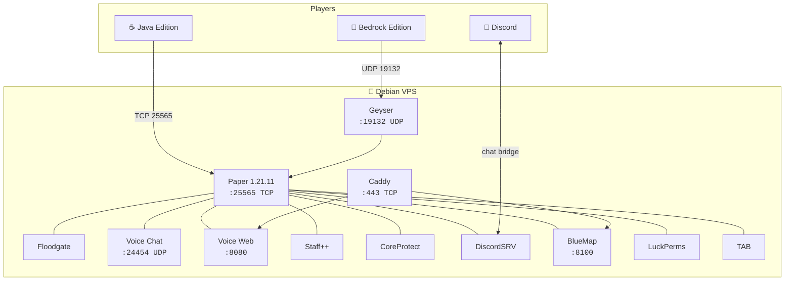

<div align="center">


**Crossplay survival server stack for Debian**

Java + Bedrock · Voice chat · Staff tools · Web map · Discord · Auto updates · Auto backups

<br>

[](https://papermc.io/)
[](https://openjdk.org/)
[](https://www.debian.org/)
[](https://www.minecraft.net/)
[](https://geysermc.org/)

<br>

[](https://github.com/it-me2001/piscessmp)
[](#-deploy-in-60-seconds)

<br>

[Deploy](#-deploy-in-60-seconds) ·
[Features](#-features) ·
[Connect](#-how-players-connect) ·
[Automation](#-automation) ·
[Scripts](#-scripts)

</div>

<br>

## Deploy in 60 seconds

Clone on a fresh **Debian 12/13** VPS and run the production installer:

```bash
git clone https://github.com/it-me2001/piscessmp.git
cd piscessmp
chmod +x setup.sh scripts/*.sh
sudo ./setup.sh --production --accept-eula
sudo systemctl start piscessmp
```

After the server generates configs (first boot):

```bash
./scripts/configure.sh --apply
sudo systemctl restart piscessmp
```

<details>
<summary><strong>Step-by-step install</strong></summary>

<br>

```bash
# 1. System deps (Java 21, curl, python3, unzip)
sudo ./setup.sh --install-deps

# 2. Download Paper + plugins, accept EULA
./setup.sh --accept-eula

# 3. Firewall + systemd + scheduled tasks
sudo ./setup.sh --firewall --systemd --timers

# 4. Start
./scripts/start.sh
# or: sudo systemctl start piscessmp
```

</details>

---

## Features

| | Component | What it does |
|:--:|-----------|--------------|
| 🌐 | **Geyser + Floodgate** | Bedrock players join without owning Java Edition |
| 🎙️ | **Simple Voice Chat** | Proximity voice — mod for Java, browser for Bedrock |
| 🛡️ | **Staff++** | Ban, mute, kick, freeze, vanish, player reports |
| 🏷️ | **LuckPerms + TAB** | Rank prefixes on nametags and tab list |
| 🔄 | **ViaVersion** | Older Java clients can still connect |
| 🧱 | **CoreProtect** | Log and roll back block changes / griefing |
| 💬 | **DiscordSRV** | Bridge in-game chat to Discord |
| 🗺️ | **BlueMap** | Live web map at port 8100 |
| 🔒 | **Caddy proxy** | HTTPS for voice + map on your domain |
| 📦 | **Auto updater** | Paper + all plugins — daily at 4 AM |
| 💾 | **Auto backups** | Worlds + configs — every 6 hours, 7 retained |

<br>



### Requirements

| | Spec |
|:--:|------|
| OS | Debian 12 or 13 |
| Java | 21 (`openjdk-21-jre-headless`) |
| RAM | 4 GB min · 6 GB+ recommended |
| Disk | 10 GB+ |

> **Debian 12:** Java 21 may need backports — `./setup.sh --install-deps` handles this.

---

## How players connect

| Platform | Address | Client setup |
|----------|---------|--------------|
| **Java** | `your-ip:25565` | Minecraft 1.21.x |
| **Bedrock** | `your-ip:19132` | No mods needed |
| **Voice (Java)** | Press `V` in-game | [SVC mod 2.6.18](https://modrepo.de/minecraft/voicechat/downloads) |
| **Voice (Bedrock)** | `/svg` then open browser | `http://your-ip:8080` or `https://voice.yourdomain.com` |
| **Web map** | Browser | `http://your-ip:8100` or `https://map.yourdomain.com` |

### Ports

| Port | Protocol | Service |
|------|----------|---------|
| `25565` | TCP | Java Edition |
| `19132` | UDP | Bedrock / Geyser |
| `24454` | UDP | Simple Voice Chat |
| `8080` | TCP | Voice web UI |
| `8100` | TCP | BlueMap web |
| `80` / `443` | TCP | Caddy HTTPS (optional) |

```bash
sudo ./scripts/debian-firewall.sh
```

---

## After first start

`configure.sh` patches Geyser, TAB, RCON, voice, and Discord settings:

```bash
./scripts/configure.sh --apply
```

**Discord bridge** — edit `server/plugins/DiscordSRV/config.yml` with your [bot token](https://discord.com/developers/applications). Template: [`discordsrv-config.yml.example`](server/config-templates/discordsrv-config.yml.example)

**HTTPS + custom domain:**

```bash
cp deploy/domain.env.example deploy/domain.env
# set DOMAIN, ACME_EMAIL, VOICE_HOST, MAP_HOST
sudo ./scripts/setup-caddy.sh
```

Grant staff permissions in the server console:

```mcfunction
/lp group staff permission set staff.* true
/lp user YourName parent set staff
```

More rank commands → [`server/config-templates/luckperms-commands.txt`](server/config-templates/luckperms-commands.txt)

---

## Automation

<table>
<tr>
<td width="50%" valign="top">

### Updates

```bash
./scripts/update.sh --check
./scripts/update.sh
./scripts/update.sh --restart
```

- Paper + all plugins
- World backup before updating
- Daily timer at **4:00 AM**

</td>
<td width="50%" valign="top">

### Backups

```bash
./scripts/backup.sh
./scripts/backup.sh --offline
```

- Worlds, plugins, configs
- RCON `save-all flush` when configured
- Every **6 hours**, keeps **7** snapshots

</td>
</tr>
</table>

**Restore a backup:**

```bash
sudo systemctl stop piscessmp
cd server && tar -xzf backups/worlds/piscessmp-*.tar.gz
sudo systemctl start piscessmp
```

**Systemd timers:**

```bash
sudo systemctl list-timers 'piscessmp-*'
```

| Timer | Schedule |
|-------|----------|
| `piscessmp-update.timer` | Daily 4:00 AM |
| `piscessmp-backup.timer` | Every 6 hours |

---

## Scripts

| Command | Description |
|---------|-------------|
| [`./setup.sh`](setup.sh) | Master installer |
| [`./setup.sh --production`](setup.sh) | Full production setup |
| [`./scripts/start.sh`](scripts/start.sh) | Start server (Aikar JVM flags) |
| [`./scripts/configure.sh --apply`](scripts/configure.sh) | Apply plugin configs |
| [`./scripts/setup-caddy.sh`](scripts/setup-caddy.sh) | HTTPS reverse proxy |
| [`./scripts/update.sh`](scripts/update.sh) | Update Paper + plugins |
| [`./scripts/backup.sh`](scripts/backup.sh) | Backup worlds + configs |

---

## Project structure

```
piscessmp/
├── setup.sh                    # ← start here
├── scripts/
│   ├── start.sh
│   ├── configure.sh
│   ├── setup-caddy.sh
│   ├── update.sh
│   └── backup.sh
├── deploy/                     # systemd units + timers
└── server/
    ├── paper.jar
    ├── plugins/
    ├── config-templates/
    └── backups/worlds/
```

---

<div align="center">

<br>

**[it-me2001/piscessmp](https://github.com/it-me2001/piscessmp)**

Built for Debian · Ready for crossplay

<br>

```bash
git clone https://github.com/it-me2001/piscessmp.git && cd piscessmp && sudo ./setup.sh --production --accept-eula
```

<br>

**Powered by**

[Paper](https://github.com/PaperMC/Paper) · [Geyser](https://github.com/GeyserMC/Geyser) · [Floodgate](https://github.com/GeyserMC/Floodgate) · [ViaVersion](https://github.com/ViaVersion/ViaVersion) · [ViaBackwards](https://github.com/ViaVersion/ViaBackwards)

[Simple Voice Chat](https://github.com/henkelmax/simple-voice-chat) · [SimpleVoice-Geyser](https://github.com/TheodoreMeyer/SimpleVoice-Geyser) · [Staff++](https://github.com/garagepoort/StaffPlusPlus) · [LuckPerms](https://github.com/LuckPerms/LuckPerms) · [TAB](https://github.com/NEZNAMY/TAB)

[CoreProtect](https://github.com/PlayPro/CoreProtect) · [DiscordSRV](https://github.com/DiscordSRV/DiscordSRV) · [BlueMap](https://github.com/BlueMap-Minecraft/BlueMap) · [PlaceholderAPI](https://github.com/PlaceholderAPI/PlaceholderAPI) · [Caddy](https://github.com/caddyserver/caddy)

</div>
